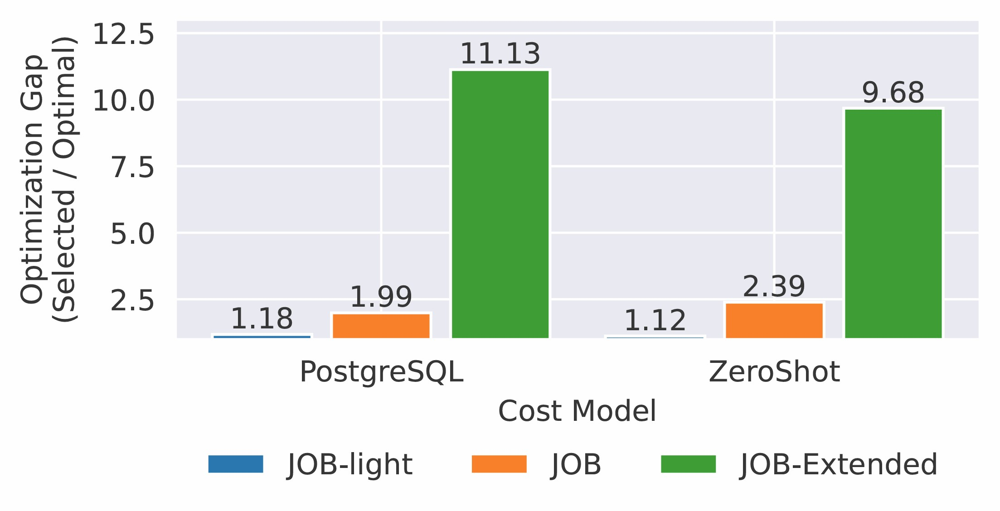

# JOB-Extended: A Hard and Realistic Benchmark for Traditional and Learned Query Optimization

Sourcecode of our AIDB '25 paper "JOBExtended: A Hard and Realistic Benchmark for
Traditional and Learned Query Optimization"

<p align="center">
  
</p>

## Abstract
Query optimization is a fundamental task in database systems that crucially needs to be solved to provide high performance. In recent years, traditional and learned query optimizers and cost models successfully demonstrated near-optimal performance over standard benchmarks, like JOB or JOB-Light. However, existing benchmarks are inherently limited, as they fail to reflect real-world properties of query optimization. Simple but realistic properties, such as non-primary key columns in join conditions, join over string columns, or complex filter predicates, can drastically reduce the performance of existing query optimizers.

Thus, we introduce **JOB-Extended**, a new benchmark designed to be more realistic and challenging for query optimizers by reflecting real-world complexity. Overall, JOB-Extended contains 30 SQL queries and moreover comes with 5131 picked execution plans, making it a valuable resource to evaluate the performance of query optimizers and cost models in real-world scenarios. Our evaluation shows that traditional and learned optimizers still struggle to achieve high performance on JOB-Extended, providing a runtime of up to 100x slower compared to the optimal plan.

## Citation

Please cite our paper if you find this work useful or use it in your own research:

```
TODO
```

# JOBExtended
The 30 JOB-Extended SQL queries are listed in `JOBExtended.sql`. These queries build on the JOB benchmark and are designed to incorporate real-world complexities often missing in standard benchmarks.

## The Need For A New Benchmark
Standard benchmarks like TPC-H, JOB, and JOB-light do not fully capture the diversity and complexity of real-world workloads.
- TPC-H uses synthetic data lacking real-world correlations.
- JOB & JOB-light, while using real-world data (IMDB), still operate under simplifying assumptions (e.g., normalized schemas, PK/FK constraints rigidly enforced).
- Real-world scenarios often involve joins on non-key columns, string-based join conditions, and complex filter predicates (e.g., `LIKE`, `IN` clauses with many values).
Current standard benchmarks fail to adequately capture these properties, limiting their effectiveness in evaluating query optimizers and often resulting in overly optimistic performance assessments.

## Introducing JOB-Extended
To address this gap, JOB-Extended offers a novel and hard benchmark.
- It consists of 30 hand-crafted SQL queries.
- These queries reflect real-world conditions:
    - Joins on non-primary/foreign key columns
    - Joins on string columns
    - Complex filter predicates
- It provides multiple execution plans for each query (5131 total), including physical plans with estimated/actual costs and cardinalities. This is crucial for learned approaches.
- JOB-Extended demonstrates how relatively simple modifications to the well-known JOB-benchmark can create a significantly more challenging and realistic benchmark.
- It shows an optimization gap of up to **11.13x** with PostgreSQL and **9.68x** with the learned Zero-Shot model, significantly higher than JOB (1.99x) and JOB-light (1.18x).

### Key Characteristics Comparison

| Benchmark         | Number of Queries | Number of Joins | String Filters | Join on Non-PK/FK columns | Join on String Columns | Runtime of Optimal Plans (s) | Runtime of PG selected Plans (s) | Optimization Potential |
|-------------------|-------------------|-----------------|----------------|---------------------------|------------------------|------------------------------|------------------------------------|------------------------|
| JOB-light         | 70                | 1-3             | --             | --                        | --                     | 2359.72                      | 2795.53                            | **1.18**               |
| JOB               | 113               | 3-14            | ✓              | --                        | --                     | 156.79                       | 312.23                             | **1.99**               |
| **JOB-Extended (ours)** | **30**            | **5-14**        | **✓**          | **✓**                     | **✓**                  | **53.34**                    | **593.50**                         | **11.13**              |

*Runtimes are aggregated over all queries in each benchmark.*

An example query snippet from JOB-Extended highlighting these complexities:
```sql
SELECT MIN(chn.name), ...
FROM complete_cast cc, comp_cast_type cct1, comp_cast_type cct2, ... -- (11 other tables)
WHERE cct1.kind = 'cast'
AND cct2.kind LIKE '%complete%'
AND chn.name IS NOT NULL
AND (chn.name LIKE '%man%'
    OR chn.name LIKE '%Man%')   -- Complex Predicates
AND k.keyword IN (...)
AND ... -- (other filters)
AND chn.id = ci.person_role_id          -- w/o PK
AND ak.name_pcode_cf=n.name_pcode_cf    -- on strings
AND ak.name_pcode_nf=chn.name_pcode_nf  -- on strings
AND ... -- (other join conditions)
```

## Contributions
1. We introduce **JOB-Extended**, a novel benchmark for query optimization and cost estimation that incorporates real-world challenges such as joins on non-primary/foreign key columns, joins on string columns, and complex filter predicates.
2. We make **JOB-Extended** publicly available (TODO: Add GitHub link here) to foster future research and development in query optimization, encouraging the community to address these identified challenges.

# Download Plan-Selection Dataset
You can download the plan selection datasets for JOBExtended, JOB and JOB-light from [here](https://osf.io/z6v95/?view_only=46f1fbb4da7d4bc986c838e394865e56).
They include tens of thousands of plans for the different benchmarks.
All plans are in the format of the PostgreSQL 'EXPLAIN (ANALYZE, VERBOSE, FORMAT JSON)' command.
Further these datasets include in addition also query plans which timed out.
You can identify these by the 'timeout' flag that is set, and the missing runtime measurement.

# Analysis Notebook
All our notebooks to analyze the speedup potential, query optimization performance, cost & cardinality estimation accuracy you can find in the notebooks folders.
Here the results of the learned cost models on these benchmarks are also stored.
